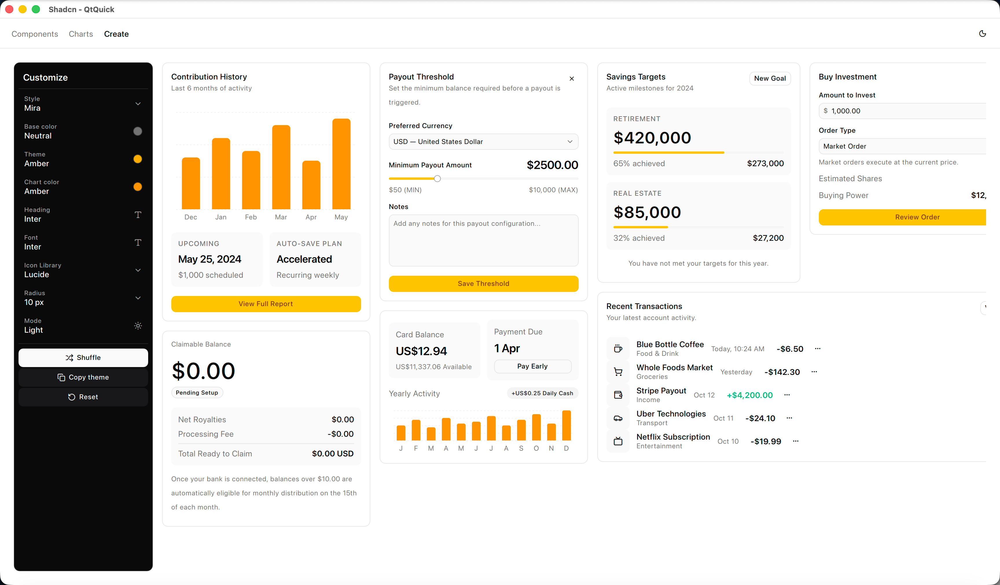
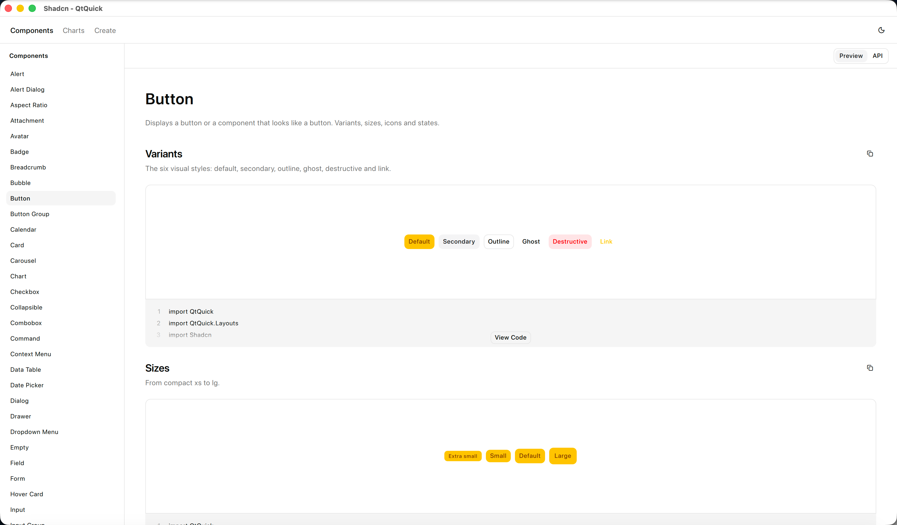
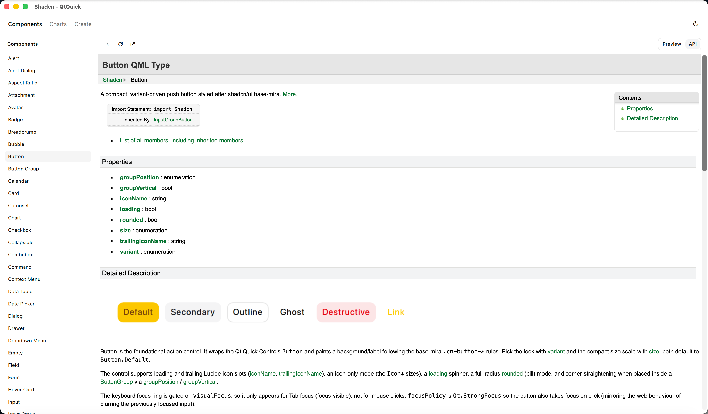

# shadcn-qtquick

[English](README.md) | **简体中文**

[](LICENSE)


一个高还原度的 [shadcn/ui](https://ui.shadcn.com) [Qt Quick](https://doc.qt.io/qt-6/qtquick-index.html) / QML
移植项目。它把 shadcn/ui 的组件集、令牌(token)驱动的主题系统,以及紧凑的
*base-mira* 视觉风格带到原生 Qt 应用中——不用 WebView,没有 HTML/CSS,纯 QML,
由 Qt 场景图直接渲染。

<p align="center">
  
</p>

目前已提供 62 个组件,从基础件(Button、Input、Checkbox、Badge)到复合件
(Dialog、Sheet、Command、Combobox、Calendar、Data Table、Sidebar),再到图表和
排版——每一个都忠实于上游设计,并由同一套设计令牌驱动。整套组件可在运行时重新
换肤:颜色、圆角、字体族都会实时更新,如上方定制器所示。

## 截图

内置的 gallery 是一个可浏览的组件总览,布局参照 ui.shadcn.com——包含带可复制源码
的实时 **Preview**,以及一份从组件 QDoc 生成、内嵌其中的 **API** 参考文档。

<table>
  <tr>
    <td width="50%"></td>
    <td width="50%"></td>
  </tr>
  <tr>
    <td align="center"><em>带实时源码的组件预览</em></td>
    <td align="center"><em>内嵌的 QDoc API 参考</em></td>
  </tr>
</table>

## 特性

- **令牌驱动的主题系统。** 一个 `Theme` 单例暴露 shadcn/ui 的颜色、圆角、字体令牌,
  并支持明/暗两套覆盖值。可在运行时对整套组件重新换肤——颜色、圆角、字体族全部
  实时生效。
- **base-mira 还原度。** 间距、圆角和排版都对齐 shadcn/ui 紧凑的 base-mira 参考值。
- **Lucide 图标。** 通过 `lucide-qtquick` 子模块内置。
- **文档齐全。** 每个组件都带 QDoc 注释;gallery 会把该参考文档内嵌在每个实时示例
  旁边。
- **有测试。** 一套 800+ 用例的 QuickTest 测试套件守护行为与外观回归。

## 环境要求

- Qt **6.8** 或更新版本(Core、Gui、Qml、Quick)
- CMake **3.22+**
- 支持 C++20 的编译器

## 快速开始

```bash
git clone --recurse-submodules https://github.com/JunchongTang/shadcn-qtquick.git
cd shadcn-qtquick

cmake -B build -DCMAKE_PREFIX_PATH=/path/to/Qt/6.8.6/<platform>
cmake --build build
```

运行 gallery:

```bash
./build/examples/gallery/shadcn_gallery
```

运行测试套件:

```bash
cmake --build build --target tst_shadcn
QT_QPA_PLATFORM=offscreen ./build/tests/tst_shadcn
```

构建选项:`-DSHADCN_BUILD_EXAMPLES=OFF` 和 `-DSHADCN_BUILD_TESTS=OFF` 可分别跳过
gallery 和测试。

## 在你的项目中使用

本库编译为一个 URI 为 `Shadcn` 的静态 QML 模块。把本仓库作为子目录加入(或通过
CMake `FetchContent`),链接该模块后即可导入:

```qml
import Shadcn

Button {
    text: qsTr("Continue")
    onClicked: console.log("clicked")
}
```

## 主题定制

所有外观都通过 `Theme` 单例流转,因此你是一次性给整套组件换肤,而不是逐个控件去
设置样式:

```qml
import Shadcn

// 切换明/暗
Theme.dark = true

// 覆盖某个颜色令牌(明色和/或暗色)
Theme.setToken("primary", "#2563eb", false)   // 明色
Theme.setToken("primary", "#3b82f6", true)     // 暗色

// 圆角与字体
Theme.setRadius(8)
Theme.fontHeadingOverride = "Georgia"

Theme.resetTheme()   // 恢复 base-mira 默认值
```

gallery 里的 **Create** 页(第一张截图)就是这套 API 的可视化前端——基础色、强调色、
图表配色、圆角、字体都能在那里调。

## 项目结构

| 路径 | 内容 |
| --- | --- |
| `src/qml/<component>/` | 组件源码;共享部件放在 `src/qml/core/` |
| `examples/gallery/` | gallery 应用,以及 `demos/<component>/` 下的各组件示例 |
| `tests/` | QuickTest 测试套件(`tst_*.qml`) |
| `third_party/lucide-qtquick/` | Lucide 图标子模块 |
| `docs/` | 文档构建脚本与生成的 hero 图 |

## 致谢与许可

本项目是 [shadcn](https://github.com/shadcn) 的 [shadcn/ui](https://ui.shadcn.com)
的移植,依据 MIT 许可证使用。图标来自 [Lucide](https://lucide.dev)(ISC 许可证)。

shadcn-qtquick 以 [MIT 许可证](LICENSE)发布;上游 shadcn/ui 的版权声明保留在该文件中。
